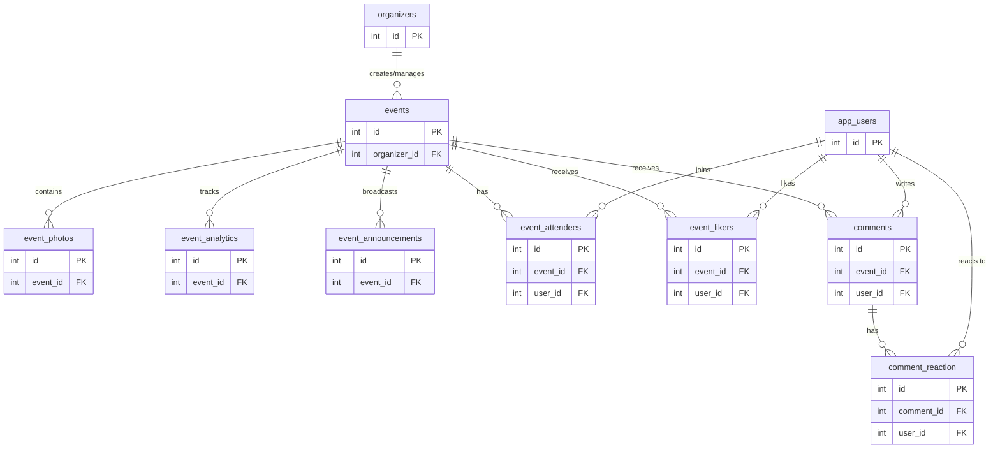

# Event System Documentation

This document provides a concise, structured overview of the Event System. It is designed to act as a definitive reference for AI models and developers interacting with this project.

## 1. System Overview
The application is a role-based Event Management & Pathfinding system. It allows **Organizers** to create and manage events, **Clients/App Users** to discover, interact with, and navigate to events, and **Admins** to moderate the overall platform.

---

## 2. Database Structure

The database utilizes relational links between user types and event aggregates. For absolute clarity, here are the exact core tables included in this ecosystem:

1. **`events`**: Core table housing the actual event details.
2. **`organizers`**: Users who manage and create events.
3. **`app_users`**: Client-side end-users interacting with events.
4. **`event_photos`**: Imagery/media linked to specific events.
5. **`event_likers`**: Records which `app_users` "liked" a given event.
6. **`event_analytics`**: Aggregated statistics and tracking data per event.
7. **`event_announcements`**: Updates broadcasted by organizers for their events.
8. **`event_attendees`**: The RSVP/roster mapping `app_users` joining `events`.
9. **`comments`**: Discussions left by `app_users` on an event.
10. **`comment_reaction`**: Like/dislike reactions left by `app_users` on specific `comments`.

---

## 3. Page Wiring & View Structure

The views are strictly separated into three portals corresponding to the three primary roles (`clients`, `organizers`, `admins`).

### 3.1 Client Portal (`src/views/client/`)
For end-users (`app_users`) browsing and interacting with events.
*   `index.ejs` / `home.ejs`: Landing pages / main feed for discovering events.
*   `login.ejs` & `signup.ejs`: Authentication flows for the App Users.
*   `details.ejs`: Detailed view of a specific event (shows photos, announcements, comments).
*   `map.ejs`: Specialized view for map/pathfinding integration (to guide the user to the event location).

### 3.2 Organizer Portal (`src/views/organizer/`)
For event creators managing their offerings.
*   `login.ejs`: Dedicated organizer authentication.
*   `dashboard.ejs`: Top-level overview of the organizer's active events and summaries.
*   `profile.ejs`: Organizer account management.
*   `events.ejs`: Master list of the organizer's own events.
*   `add_event.ejs`: Form to create a new event.
*   `event_details.ejs`: Deep-dive management of a single event (e.g., managing attendees, making announcements).
*   `analytics.ejs`: View data tied to `event_analytics` (engagement, RSVPs, likes).

### 3.3 Admin Portal (`src/views/admin/`)
For system-level moderation and oversight.
*   `dashboard.ejs`: Global platform overview.
*   `organizers.ejs`: User management screen specifically for auditing/moderating Organizer accounts.
*   `events.ejs`: Global list of all events across all organizers.
*   `event_details.ejs`: Auditing view for a specific event (content moderation, enforcement).

---

## 4. Feature Information

*   **Role-Based Access Control (RBAC)**: Distinct permissions and views for `App Users`, `Organizers`, and `Admins`.
*   **Event Lifecycle Management**: Organizers can Create, Read, Update, and (presumably) Delete events, alongside linking photos (`event_photos`).
*   **Social Engagement**: 
    *   **RSVPs/Attendance**: Tracked via `event_attendees`.
    *   **Reactions**: Users can like events (`event_likers`) to show interest.
    *   **Discussions**: Users can leave `comments` on events, and engage further via `comment_reaction` (likes/upvotes on comments).
*   **Real-time/Updates**: Organizers can push updates out to attendees via `event_announcements`.
*   **Data & Analytics**: Organizers are provided an `analytics.ejs` dashboard, backed by `event_analytics` (likely tracking page views, conversion rates of viewers to attendees, demographic data).
*   **Navigation Context**: Intersecting with physical maps/pathfinding module via `map.ejs`, implying the system helps attendees navigate physical spaces to event locations.

---

## 5. Security & Authentication

*   **Partitioned Identity Tables**: `app_users` and `organizers` are conceptually and physically separated. This prevents Privilege Escalation vulnerabilities.
*   **Segmented Routing**: Views restrict entry points. API routes should validate session roles before rendering the respective `.ejs` files.
*   **Granular Authorization**: 
    *   *Admins*: Global Read/Update/Delete.
    *   *Organizers*: Scoped to `WHERE organizer_id = ?` for events and analytics.
    *   *Clients/App Users*: Public read for events; Write access solely for their own records in join tables (`comments`, `event_likers`, `event_attendees`, `comment_reaction`).

## 6. Purpose of this Document
When executing tasks, writing database queries, or scaffolding new routes, refer to this document to understand relationship chains (e.g., getting an event's comments requires joining `events` -> `comments` -> `app_users`) and boundary contexts (e.g., never mix `organizers` login with `app_users` logic).